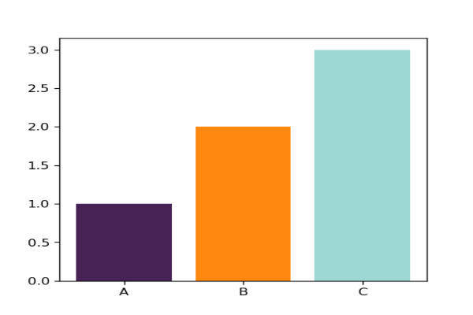

# PrettyCols

Python package containing pretty colour palettes. This package is based on the R implementation available at [github.com/nrennie/PrettyCols](https://github.com/nrennie/PrettyCols).

## Installation

Install using `pip` from GitHub:

```bash
pip install git+https://github.com/nrennie/PrettyPyCols.git#egg=PrettyCols
```

## Using with matplotlib

Then load the package (and `matplotlib`):

```python
import PrettyCols as pc
import matplotlib.pyplot as plt
```

colors = pc.prettycols(name="Bright", n=3, palette_type="discrete")
x = ['A', 'B', 'C']
value = [1, 2, 3]
plt.bar(x, value, color=colors)
plt.show()
```


